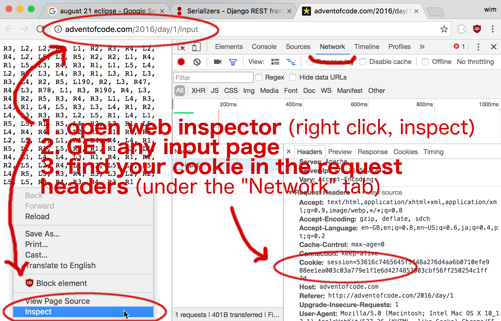

# Advent of code data | aocd

Get your advent of code input every day with a simple function call.

- download new advent of code input
- load advent of code input into your code as a String
- cache input so that you only need to download input once

_Clojure version of the [scala library](https://github.com/bbstilson/advent-of-code-data) by the same name_
_that is in turn based on a [python library](https://github.com/wimglenn/advent-of-code-data)._

## Usage

### Quick start

```clojure
(require '[aocd.core :as data])
(data/input 2019 4) => "124075-580769\n"
```

### Installation

`aocd` is available as a Maven artifact from [Clojars](https://clojars.org/aocd).

Leiningen/Boot:

```clojure
[aocd "0.1.0"]
```

### Setup

[Advent of code](https://adventofcode.com/) inputs are personal hence a session
token is needed in order to fetch your input. `aocd` supports providing this token
in two ways:

```bash
# env variable
$ export AOC_SESSION_TOKEN="yoursessionstoken"
# or config file
$ echo "yoursessiontoken" > $HOME/.config/aocd/token
```

### Cache

The downloaded input files are stored in

`$HOME/.config/aocd/{year}/{day}/input.txt`


## How to get session token

1) Log in to advent of code.
2) Open any `input` link from
3) Open developer mode



Above was taken from [here](https://github.com/wimglenn/advent-of-code-wim/issues/1)
